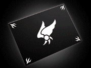

Federal Cybersecurity | Incident Response | Cyber Defense | Digital Forensics (DFIR)

## About

I work in incident response and digital forensics, most of it as a federal contractor supporting the U.S. Nuclear Regulatory Commission (NRC). I triage security alerts, lead incident response, and build the CSIRT documentation and testing programs teams rely on. My background also includes hands-on digital forensics work going back to a DHS Cyber Crime Center internship and graduate research at George Mason University.

## Portfolios

[Incident Response Portfolio](https://github.com/ftj258/incident-response-portfolio) — playbooks, CSIRT procedures, tabletop exercises, and incident reports

[Cybersecurity Portfolio](https://github.com/ftj258/cybersecurity-portfolio) — cloud security workflows, digital forensics documentation, and governance frameworks

[Site](https://ftj258.github.io) — full resume-style portfolio site

## Tools I work with

Splunk • Fidelis • CrowdStrike Falcon • Microsoft Defender XDR • Cortex XDR • Magnet AXIOM • ServiceNow • Archer

## Contact

[LinkedIn](https://linkedin.com/in/fjohra)
